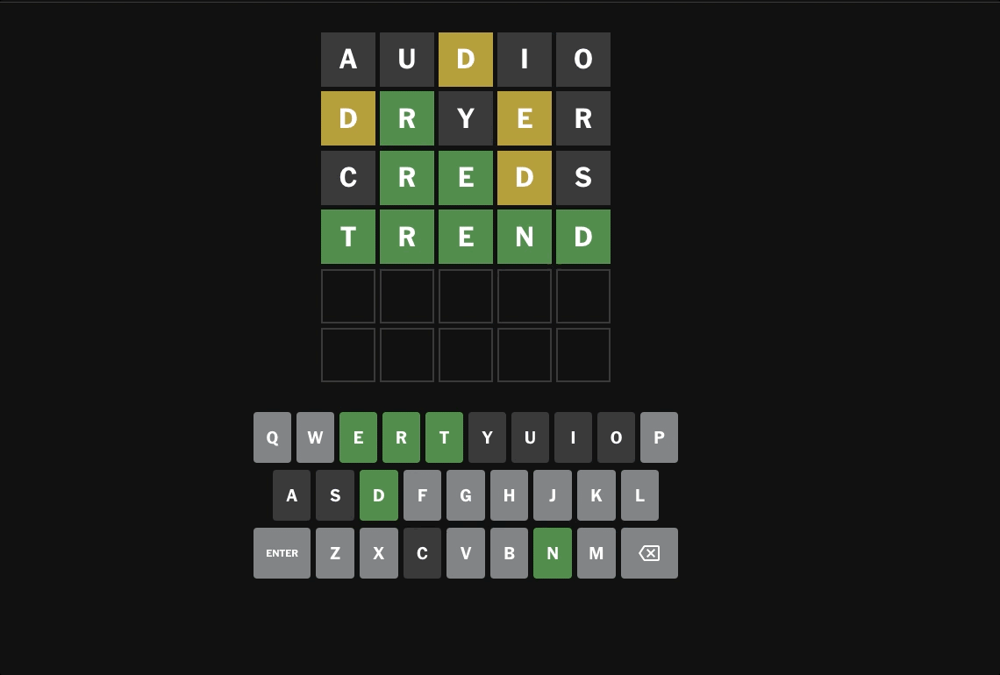

# wordle_solver

A little CLI that solves wordle problems.

https://www.nytimes.com/games/wordle/index.html

## Help Text

usage: wordpy [-h] -s STRING [-r REMAINING] [-y YELLOW]

options:

  -h, --help            
  show this help message and exit

  -s STRING, --string STRING
                        
a 5-char string with letters and underscores only,
representing correctly placed letters and unknown
positions
  
-r REMAINING, --remaining REMAINING
                        
a string containing letters only, which may fill the
empty, unknown spaces
  
-y YELLOW, --yellow YELLOW
                        
a comma-separated string. Each value is a letter &
numbers representing the wrong position(s). This will
filter out solutions that lack yellow letters, or with
those letters in the wrong position(s). Example:
y35,d2,e4
